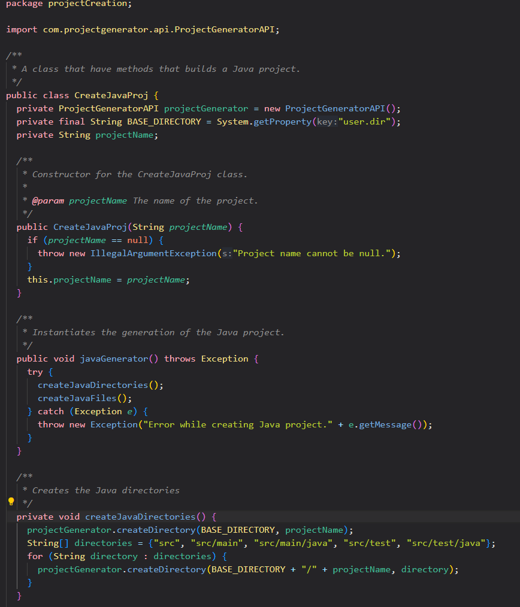

# Reflection of laboration 3

## Chapter 2: Intention-Revealing Names
During this project, choosing the right names for methods was my main focus. The Clean Code book influenced me in this aspect, suggesting names that are clear and self-explanatory. The goal was to select names that described exactly what the method does, so much so that there was often no need for additional comments. It was all about having names that revealed their intentions without being cryptic. I think i have succeeded in this aspect for the most part.

## Chapter 3: Do One Thing
I continued to draw from my experiences in Laboratory 2, I stuck with the principle of "Do One Thing". This meant that every method I created had just one job to do. This focus helped in making sure the code was neat, clear, and that every piece had a specific role. This, I believe, added to the overall clarity and simplicity of my code. The one method im not really happy about is the **'run()'** method in my class EzprojCommand, because it is doing more than one thing, but all that information is nessesary for the cli tool to work. But i could have separated the code a bit more.

## Chapter 4: Mumbling
My stance on comments was a bit two-sided this time. In this project i aimed for my code to speak for itself, but I found myself adding comments that perhaps weren't always necessary. I felt like I was sometimes just mumbling through comments, just like the book suggested. There were moments where comments felt more like a duty than something genuinely helpful. Many comments during this project were just me repeating what i had named my methods to. So i think i can really do better next time with comments.

## Chapter 5: Indentation
Using tools like Google Checkstyle was really good for my project. It played a big role in making sure the structure of my code was up to the mark. This was particularly true when it came to indentation. The tool kept reminding me to have a consistent layout for elements such as loops and conditions. This made the task of reading and understanding the code much simpler. I used 2 spaces for indentation and i think that is a good amount of spaces to use. Because if you have too many spaces it will be hard to read the code and if you have too few spaces it will also be hard to read the code, and google checksyle will tell you if you have too many or too few spaces.¨

## Chapter 6: Data Abstraction 
In the process of designing 'CreateJavaProj' and 'CreateJavaScriptProj', I tried to implement the principle of 'Data Abstraction' from the Clean Code book. The essence of this principle is hiding the complexities and intricacies of data, allowing external users to interact with the data through a defined interface without knowing the underlying implementations. By keeping most of the methods private, barring the constructors and a handful of essential ones, I ensured that the internal workings of these classes remained shielded from external interference.

## Chapter 7: Use Exceptions Rather Than Return Codes
In this project i tried to keep my error handling consistent by using a 'try-catch' and then if something when wrong, i would throw a new exception with a message. This is a good way to handle errors because it is easy to understand and it is consistent. This falls under the catagory 'Use Exceptions Rather Than Return Codes' in the book. But sometimes i would just print an error message, and that is something i could have done better. 

## Chapter 8: Using Third-Party Code
I used a third-party code called 'picocli' to create a command line interface (CLI) for the user. I used this code because it was easy to use and it was well documented. I did not have to write a lot of code to create the CLI. I just had to create a class that extends the 'CommandLine' class and then i could use the 'CommandLine' class to create the CLI. This is a good way to use third-party code because it is easy to understand and it is consistent. It is also the same structure in the class 'EzprojCommand'.

## Chapter 9: Unit Tests
I did manual testing of my cli-tool, so when it comes to chapter 9 in the book 'Clean Code' i did not follow the 'Unit Tests' principle. I did not have time to write unit tests for my cli-tool. This doesn't mean I neglected the quality assurance aspect entirely. Recognizing the importance of testing, I crafted a test specification that outlined various test cases and expected outcomes. This provided a structured approach to my manual testing, ensuring that each function and feature underwent evaluation.

## Chapter 10: Class Orginaization
In 'CreateJavaProj' i think i followed the 'Class Orginaization' principle pretty well. I have the private variables directly under the class declaration and then the constructor and then the methods. The only public method was first and the private methods that would be called upon in the public method was last. This is a good way to organize a class because it is easy to understand and it is consistent. It is also the same structure in the class 'CreateJavaScriptProj'.

## Chapter 11: Optimize Decision Making
When I started this project, I made a simple yet usefull choice that i would divide the functionality into four distinct classes. I took inspiration from the Clean Code book, which emphasizes 'Optimize Decision Making.' I found that breaking things down into classes made everything clearer. Instead of one big block of code, I had four separate parts. Each part had its role and purpose. This made the code more readable for me. If I needed to revisit a function or debug an issue, I knew exactly where to look. I wasn't overwhelmed with everything in one place.

